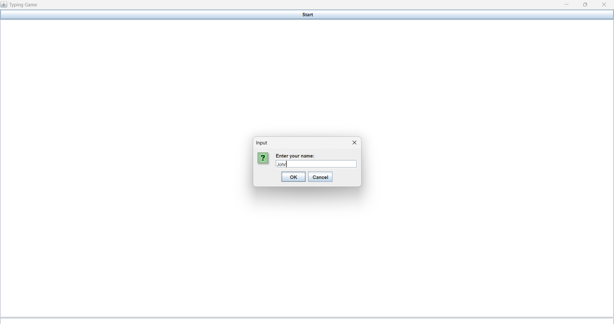

# Typing Game

This project is a simple typing game built using **Java**, designed to improve your typing speed and accuracy. The game presents random words that you must type within a given time frame. Your performance is tracked based on how quickly and accurately you type each word.

## Features

- Random word generation.
- Tracks typing speed and accuracy.
- Provides real-time feedback on performance.
- Easy-to-use graphical interface.
- Fun way to improve typing skills.

## Technologies Used

- **Programming Language:** Java
- **Libraries & Tools Used:**
  - **AWT (Abstract Window Toolkit)** and **Swing** for creating the graphical user interface (GUI).
  - **Timer** for tracking the duration of the game.
  - **ArrayList** and **Random** for word generation and randomization.
  
## How to Run the Project

1. Clone the repository to your local machine:
   ```bash
   git clone https://github.com/yourusername/typing-game.git
   ```
2. Open the project in your preferred Java IDE (such as IntelliJ IDEA or Eclipse).
3. Compile and run the `TypingGame.java` file.
4. Play the game by typing the displayed words as quickly and accurately as possible!

## This is how the program output looks:

Here are screenshots showing the game in action:

### Main Screen:


### Typing in Progress:


### Game Over Screen:


## Future Enhancements

- Add more difficulty levels.
- Integrate score tracking and leaderboard functionality.
- Expand the word database for more variety.
- Support multiplayer mode.

## Contributions

Contributions are welcome! If you'd like to improve this project, feel free to open a pull request or submit issues for any bugs or feature requests.
